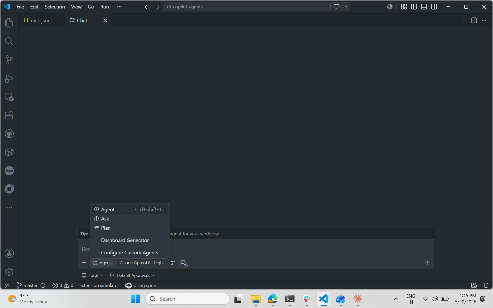
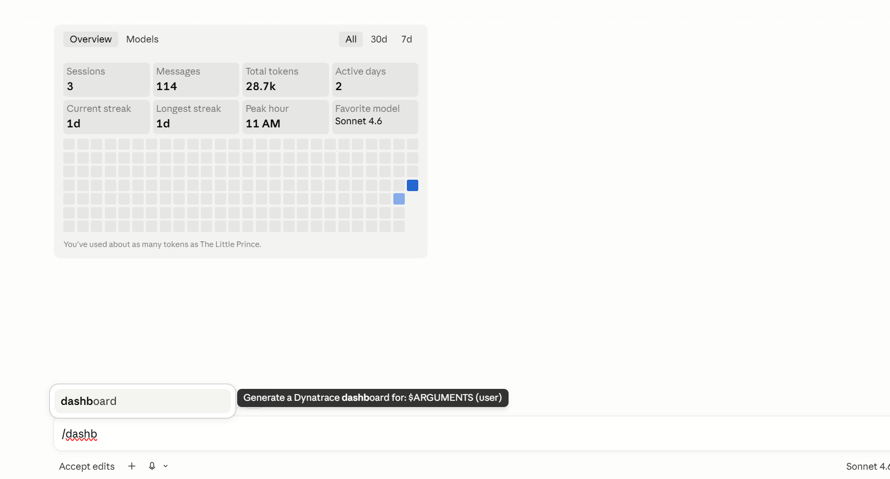

# Dynatrace Copilot Agents

Cross-platform AI agents for Dynatrace demo workflows. Works on **VS Code Copilot**, **Claude Code**, **Cursor**, **Windsurf**, and **OpenAI GPTs**.

## Get Started

### 1. Install

```bash
npx dt-copilot-agents install vscode        # VS Code Copilot
npx dt-copilot-agents install claude-code .  # Claude Code
npx dt-copilot-agents install cursor .       # Cursor
npx dt-copilot-agents install                # All platforms at once
```

### 2. Use

**VS Code Copilot** — Open Chat (`Ctrl+Alt+I`) → click the mode selector → pick **Dashboard Generator** → type your prompt



**Claude Code** — Type `/dashboard` in the chat input → select the slash command → provide your prompt



**Cursor / Windsurf** — Just ask in chat:

### 3. Prompt

```
SRE dashboard for Tata Steel
CISO dashboard for HDFC Bank
CEO dashboard for Reliance Industries
```

The agent researches the company, generates a 20-tile dashboard with synthetic data, and deploys it to your Dynatrace tenant — all automatically. No data ingestion needed.

> **Zero prerequisites.** The agent auto-installs `dtctl` CLI and authenticates via browser SSO if not already set up.

---

## What's Included

### Dashboard Generator
Generates and deploys realistic persona-specific dashboards with synthetic data for customer meetings — in under 5 minutes.

**Supported Personas:**
| Executive | Technical / Operations |
|---|---|
| CEO — Business Impact | SRE — Reliability & SLOs |
| CIO — IT Strategy (default) | IT Head — Infrastructure |
| CTO — Technology & Innovation | Application Ops — APM |
| CISO — Security & Compliance | MLOps — AI/Model Operations |
| | Platform Engineering — Developer Experience |
| | VP Engineering — Delivery & Quality |

**Features:**
- Researches the company/business automatically via web
- Generates 20-tile dashboards with inline DQL `data record()` queries (zero ingestion needed)
- Supports 5 industry archetypes: E-Commerce, Manufacturing, SaaS, Financial Services, Retail
- Auto-installs `dtctl` CLI if missing (Homebrew, curl, or PowerShell one-liner)
- Authenticates via browser SSO (`dtctl auth login`) — no tokens to copy-paste
- Deploys directly to Dynatrace tenant via DTCTL CLI
- Optionally verifies DQL queries via Dynatrace MCP server
- Uses real company data (plant names, brands, products, regions)

## Platform Support

| Platform | Format | Deployment | Auto-deploy via DTCTL |
|---|---|---|---|
| **VS Code Copilot** | `.agent.md` + skill | `.\install.ps1 -Platform vscode` | Yes |
| **Claude Code** | `CLAUDE.md` + `.claude/commands/` | Copy to project root | Yes |
| **Cursor** | `.cursor/rules/*.mdc` | Copy to project root | Yes |
| **Windsurf** | `.windsurfrules` | Copy to project root | Yes |
| **M365 Copilot** | Declarative Agent + instruction.md | Teams Toolkit deploy | Via Power Automate |
| **OpenAI GPT** | System prompt + knowledge file | Create Custom GPT | No (manual deploy) |

> **Auto-setup:** The agent automatically installs `dtctl` and authenticates via browser SSO if not already set up — no manual prerequisite steps needed.

## Installation

### npm (recommended)
```bash
npx dt-copilot-agents install vscode        # VS Code Copilot
npx dt-copilot-agents install claude-code .  # Claude Code (current directory)
npx dt-copilot-agents install cursor .       # Cursor
npx dt-copilot-agents install                # All platforms at once
npx dt-copilot-agents info                   # Show supported personas & archetypes
```

### Update to latest
```bash
npx dt-copilot-agents@latest install vscode
```

### Alternative: PowerShell installer
```powershell
git clone https://github.com/pushpendrasinghbaghel-ai/dt-copilot-agents.git
cd dt-copilot-agents
.\install.ps1                        # All platforms
.\install.ps1 -Platform vscode       # VS Code only
```

### Manual setup (OpenAI / M365 Copilot)

**OpenAI Custom GPT** — see [`openai/README.md`](openai/README.md)

**M365 Copilot** — see [`m365-copilot/README.md`](m365-copilot/README.md)

## Architecture

```
dt-copilot-agents/
├── knowledge/                          # Shared knowledge (platform-agnostic)
│   └── dashboard-generator.md          # Complete procedure, DQL rules, layout grid
│
├── agents/                             # VS Code Copilot
│   └── dashboard-generator.agent.md
├── skills/                             # VS Code Copilot skill
│   └── dt-demo-dashboard/
│       ├── SKILL.md
│       └── assets/
│
├── claude-code/                        # Claude Code
│   ├── CLAUDE.md
│   └── .claude/commands/dashboard.md
│
├── cursor/                             # Cursor
│   └── .cursor/rules/dashboard-generator.mdc
│
├── windsurf/                           # Windsurf
│   └── .windsurfrules
│
├── m365-copilot/                       # Microsoft 365 Copilot
│   ├── declarativeAgent.json
│   ├── instruction.md
│   └── README.md
│
├── openai/                             # OpenAI / ChatGPT
│   ├── system-prompt.txt
│   └── README.md
│
├── install.ps1                         # Cross-platform installer
└── README.md
```

### How It Works

All platforms share the same **knowledge base** (`knowledge/dashboard-generator.md`). Each platform gets a thin wrapper in its native format that references this shared knowledge. When you update the knowledge, all platforms benefit.

## Prerequisites
- Web access (for company research)
- Platform-specific: VS Code + Copilot extension, Claude Code CLI, Cursor IDE, or Windsurf IDE

## Configuration

### Step 1: Install DTCTL CLI

**macOS/Linux (Homebrew):**
```bash
brew install dynatrace-oss/tap/dtctl
```

**macOS/Linux (shell script):**
```bash
curl -fsSL https://raw.githubusercontent.com/dynatrace-oss/dtctl/main/install.sh | sh
```

**Windows (PowerShell):**
```powershell
irm https://raw.githubusercontent.com/dynatrace-oss/dtctl/main/install.ps1 | iex
```

Verify: `dtctl version`

### Step 2: Authenticate DTCTL (browser login — recommended)

```bash
# Opens your browser for Dynatrace SSO — no tokens to copy-paste
dtctl auth login

# Or for a specific context
dtctl auth login --context <your-context-name>
```

**Alternative (CI/automation):** `dtctl auth login --token <API_TOKEN>`

The agent uses your **current DTCTL context** by default. Switch contexts with:
```bash
dtctl config use-context <your-context-name>
```

### Step 3: Connect Dynatrace MCP Server (optional — for DQL verification)

MCP enables the agent to verify DQL queries against your live tenant. **It's optional** — deployment works without it.

#### VS Code — One-click from MCP Gallery:
1. Command Palette → **MCP: Add Server** → search **"Dynatrace"** → install
2. Enter your tenant URL when prompted — authenticates via browser SSO

#### VS Code / Claude Code / Cursor — Remote MCP with token:
```
URL:  https://<YOUR_TENANT>.apps.dynatrace.com/platform-reserved/mcp-gateway/v0.1/servers/dynatrace-mcp/mcp
Auth: Bearer <YOUR_PLATFORM_TOKEN>
```
Generate a platform token at: `https://<YOUR_TENANT>.apps.dynatrace.com/ui/apps/dynatrace.classic.tokens`

See `knowledge/dashboard-generator.md` → **Authentication** section for platform-specific config snippets (VS Code `mcp.json`, Claude Code `.mcp.json`, Cursor `.cursor/mcp.json`).

## License

MIT — see [LICENSE](LICENSE).
