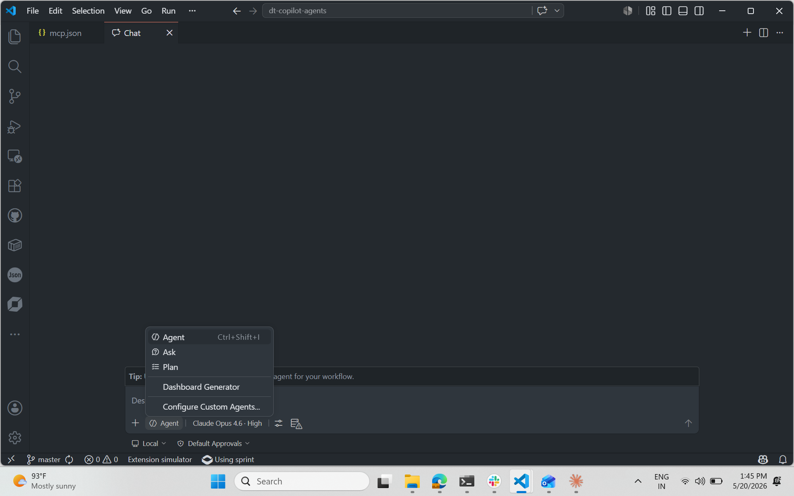
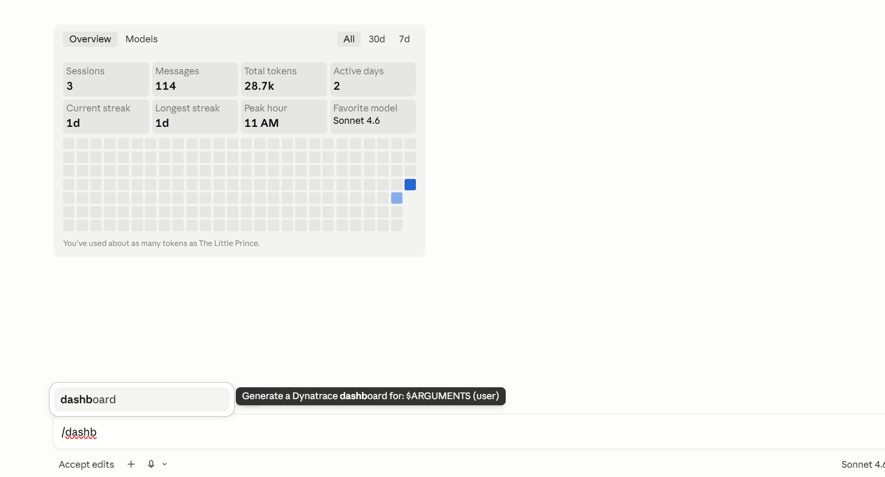

# Dynatrace Copilot Agents

Cross-platform AI agents for Dynatrace demo workflows. Works on **VS Code Copilot**, **Claude Code**, **Cursor**, **Windsurf**, and **OpenAI GPTs**.

[](https://www.npmjs.com/package/dt-copilot-agents)
[](https://www.npmjs.com/package/dt-copilot-agents)
[](LICENSE)

## Get Started

### 1. Install

#### Install

```bash
npx dt-copilot-agents install vscode        # VS Code Copilot
npx dt-copilot-agents install claude-code .  # Claude Code
npx dt-copilot-agents install cursor .       # Cursor
npx dt-copilot-agents install                # All platforms at once
```

### 2. Use

**VS Code Copilot** — Open Chat (`Ctrl+Alt+I`) → click the mode selector → pick **Dashboard Generator** → type your prompt



**Claude Code** — Type `/dashboard` in the chat input → select the slash command → provide your prompt



**Cursor / Windsurf** — Just ask in chat:

### 3. Prompt

```
SRE dashboard for Atlas Steel
CISO dashboard for Apex Bank
CEO dashboard for Summit Industries
CIO dashboard for meeting today — prospect at Helix Life Sciences
interview me for a VP Engineering dashboard

# POC Value Stories (Mode 5) — real tenant data required
MTTR improvement POC dashboard — Apex Bank, MCP connected
Log analytics value story — show DT logs vs ELK for a bank
Prove proactive monitoring value for a telco CIO
Business observability dashboard — e-commerce customer, real data
```

The agent researches the company, generates a 20-tile dashboard, and deploys it to your Dynatrace tenant — all automatically.

> **Zero prerequisites.** The agent auto-installs `dtctl` CLI and authenticates via browser SSO if not already set up.

---

## What's Included

### Dashboard Generator — 5 Modes

Generates and deploys realistic persona-specific Dynatrace dashboards — in under 5 minutes.

| Mode | Trigger | How it works |
|---|---|---|
| **Mode 1 — Demo** (default) | Any simple prompt | Generates 20-tile dashboard with inline `data record()` DQL. Zero data ingestion needed. Instant. |
| **Mode 2 — Live Tenant** | "real data", "their Dynatrace", or MCP connected | Discovers real entities via MCP → builds dashboard with live `timeseries`, `fetch logs`, `fetch spans` queries |
| **Mode 3 — Synthetic Ingest** | "ingest", "persistent demo" | Generates realistic data → ingests via MINT/BizEvents API → dashboard queries live data |
| **Mode 4 — Interview-First** | "interview me", "help me figure out" | Agent asks 6 discovery questions → infers persona, story arc, and layout → builds the perfect dashboard |
| **Mode 5 — POC Value Stories** | "MTTR", "correlation", "logs value", "business observability", "proactive", "prove value" | Runs discovery DQL against real tenant → builds 20-tile dashboard framed as a value narrative for POC sign-off |

**Meeting intelligence:** Say `"meeting today with [company]"` to unlock story-arc selection, audience targeting, and CTA-focused layouts for your specific meeting goal.

### POC Value Story Dashboards (Mode 5)

Purpose-built dashboards that frame Dynatrace data as business value — designed for POC phases where you need to prove ROI and close.

| Value Story | Trigger phrases | Audience | What it proves |
|---|---|---|---|
| **1 — MTTR Improvement** | "MTTR", "incident response", "resolution time" | SRE, IT Head, CIO | How DT cuts mean-time-to-resolve with automatic root cause |
| **2 — Correlation & Root Cause** | "correlation", "root cause", "blast radius", "deployment impact" | CTO, App Ops, SRE | Davis AI automatically links events across the full stack |
| **3 — Business Observability** | "business observability", "revenue impact", "tie IT to business" | CEO, CIO, CTO | Real-time bridge between IT health and business KPIs |
| **4 — Proactive Monitoring** | "proactive", "shift left", "before users", "Davis value" | CIO, SRE, IT Head | Davis detects anomalies before users feel them |
| **5 — Log Analytics & Intelligence** | "logs value", "log analytics", "logs vs ELK", "DQL logs", "log story" | App Ops, SRE, CTO, Platform Eng | From log chaos to instant DQL search, pattern detection, and log→trace correlation |

**Example prompts:**
```
MTTR improvement POC dashboard — Apex Bank, MCP connected
Log analytics value story for a bank — show how DT logs beats ELK
Prove proactive monitoring value for a telco CIO
Business observability dashboard — e-commerce, real data
```

**Smart layout variants** auto-select based on persona and meeting context:
| Variant | Persona / Occasion | Character |
|---|---|---|
| **A — Panorama** | CEO, CIO, Board presentations | Tall KPIs, wide charts — executive sweep |
| **B — Standard** | General / default | Balanced asymmetric grid |
| **C — Dense** | SRE, Ops, VP Engineering | Compact tiles, maximum data density |
| **D — Hero** | Renewal, PoV, first meeting | One tile dominates — the number that matters most |
| **E — Trend-First** | Growth story, degradation story | Wider time-series tiles, trend is the narrative |

**Supported Personas:**
| Executive | Technical / Operations |
|---|---|
| CEO — Business Impact | SRE — Reliability & SLOs |
| CIO — IT Strategy (default) | IT Head — Infrastructure |
| CTO — Technology & Innovation | Application Ops — APM |
| CISO — Security & Compliance | MLOps — AI/Model Operations |
| | Platform Engineering — Developer Experience |
| | VP Engineering — Delivery & Quality |

**Supported Industries:** E-Commerce · Manufacturing · SaaS/Platform · Financial Services · Retail · Life Sciences · Telco

**Features:**
- Researches the company automatically via web (real plant names, product names, regions)
- Generates 20-tile dashboards with inline `data record()` DQL (Mode 1 — zero ingestion)
- Connects to live Dynatrace tenant for real metrics (Mode 2 — via MCP)
- Ingests synthetic data via MINT/BizEvents API for persistent demos (Mode 3)
- Guided discovery interview → builds the right dashboard (Mode 4)
- **5 POC Value Story dashboards** — MTTR, Correlation, Business Observability, Proactive, Log Analytics (Mode 5)
- 5 smart layout variants that auto-select by persona and meeting context
- 6 story arcs: Risk, ROI, Visibility, Business Impact, Growth, Observability
- Deploys directly to Dynatrace tenant via `dtctl` CLI
- Validates all DQL queries before deploying (via MCP `verify_dql`)
- Layout is a flat `"layouts": { "1": {x,y,w,h} }` structure — correctly enforced

## Platform Support

| Platform | Format | Install | Auto-deploy via DTCTL |
|---|---|---|---|
| **VS Code Copilot** | `.agent.md` + skill | `npx dt-copilot-agents install vscode` | Yes |
| **Claude Code** | `CLAUDE.md` + `.claude/commands/` | `npx dt-copilot-agents install claude-code` | Yes |
| **Cursor** | `.cursor/rules/*.mdc` | `npx dt-copilot-agents install cursor` | Yes |
| **Windsurf** | `.windsurfrules` | `npx dt-copilot-agents install windsurf` | Yes |
| **M365 Copilot** | Declarative Agent | Teams Toolkit deploy | Via Power Automate |
| **OpenAI GPT** | System prompt | Create Custom GPT | No (manual deploy) |

> **Auto-setup:** The agent automatically installs `dtctl` and authenticates via browser SSO if not already set up — no manual prerequisite steps needed.

## Installation

### npm (recommended)
```bash
npx dt-copilot-agents install vscode        # VS Code Copilot
npx dt-copilot-agents install claude-code .  # Claude Code (current directory)
npx dt-copilot-agents install cursor .       # Cursor
npx dt-copilot-agents install                # All platforms at once
npx dt-copilot-agents info                   # Show supported personas & archetypes
```

### Update to latest
```bash
npx dt-copilot-agents@latest install vscode
```

### Alternative: PowerShell installer
```powershell
git clone https://github.com/pushpendrasinghbaghel-ai/dt-copilot-agents.git
cd dt-copilot-agents
.\install.ps1                        # All platforms
.\install.ps1 -Platform vscode       # VS Code only
```

### Manual setup (OpenAI / M365 Copilot)

**OpenAI Custom GPT** — see [`openai/README.md`](openai/README.md)

**M365 Copilot** — see [`m365-copilot/README.md`](m365-copilot/README.md)

## Architecture

```
dt-copilot-agents/
├── knowledge/                          # Shared knowledge (platform-agnostic)
│   └── dashboard-generator.md          # Complete procedure, DQL rules, layout grid
│
├── agents/                             # VS Code Copilot
│   └── dashboard-generator.agent.md
├── skills/                             # VS Code Copilot skill
│   └── dt-demo-dashboard/
│       ├── SKILL.md
│       └── assets/
│
├── claude-code/                        # Claude Code
│   ├── CLAUDE.md
│   └── .claude/commands/dashboard.md
│
├── cursor/                             # Cursor
│   └── .cursor/rules/dashboard-generator.mdc
│
├── windsurf/                           # Windsurf
│   └── .windsurfrules
│
├── m365-copilot/                       # Microsoft 365 Copilot
│   ├── declarativeAgent.json
│   ├── instruction.md
│   └── README.md
│
├── openai/                             # OpenAI / ChatGPT
│   ├── system-prompt.txt
│   └── README.md
│
├── install.ps1                         # Cross-platform installer
└── README.md
```

### How It Works

All platforms share the same **knowledge base** (`knowledge/dashboard-generator.md`). Each platform gets a thin wrapper in its native format that references this shared knowledge. When you update the knowledge, all platforms benefit.

## Prerequisites
- Web access (for company research)
- Platform-specific: VS Code + Copilot extension, Claude Code CLI, Cursor IDE, or Windsurf IDE

## Configuration

### Step 1: Install DTCTL CLI

**macOS/Linux (Homebrew):**
```bash
brew install dynatrace-oss/tap/dtctl
```

**macOS/Linux (shell script):**
```bash
curl -fsSL https://raw.githubusercontent.com/dynatrace-oss/dtctl/main/install.sh | sh
```

**Windows (PowerShell):**
```powershell
irm https://raw.githubusercontent.com/dynatrace-oss/dtctl/main/install.ps1 | iex
```

Verify: `dtctl version`

### Step 2: Authenticate DTCTL (browser login — recommended)

```bash
# Opens your browser for Dynatrace SSO — no tokens to copy-paste
dtctl auth login

# Or for a specific context
dtctl auth login --context <your-context-name>
```

**Alternative (CI/automation):** `dtctl auth login --token <API_TOKEN>`

The agent uses your **current DTCTL context** by default. Switch contexts with:
```bash
dtctl config use-context <your-context-name>
```

### Step 3: Connect Dynatrace MCP Server (optional — for DQL verification)

MCP enables the agent to verify DQL queries against your live tenant. **It's optional** — deployment works without it.

#### VS Code — One-click from MCP Gallery:
1. Command Palette → **MCP: Add Server** → search **"Dynatrace"** → install
2. Enter your tenant URL when prompted — authenticates via browser SSO

#### VS Code / Claude Code / Cursor — Remote MCP with token:
```
URL:  https://<YOUR_TENANT>.apps.dynatrace.com/platform-reserved/mcp-gateway/v0.1/servers/dynatrace-mcp/mcp
Auth: Bearer <YOUR_PLATFORM_TOKEN>
```
Generate a platform token at: `https://<YOUR_TENANT>.apps.dynatrace.com/ui/apps/dynatrace.classic.tokens`

See `knowledge/dashboard-generator.md` → **Authentication** section for platform-specific config snippets (VS Code `mcp.json`, Claude Code `.mcp.json`, Cursor `.cursor/mcp.json`).

## License

MIT — see [LICENSE](LICENSE).
